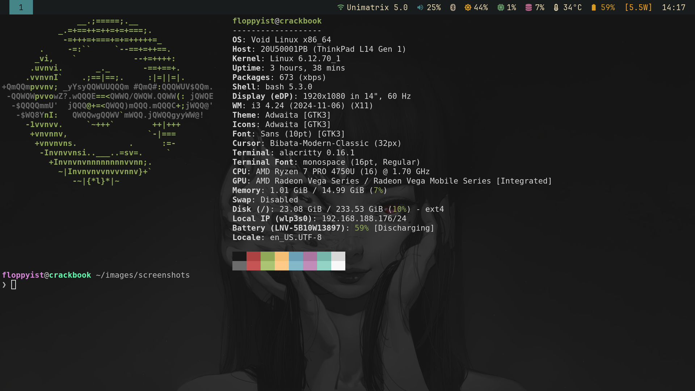

# Dotfiles (i3wm)

> [!CAUTION]
> This project is currently a **Work in Progress (WIP)**.
> Features may be incomplete and bugs are to be expected.

A minimalist and functional development environment based on **i3wm**, **Polybar**, and **Neovim** running on **Void Linux**.

<p align="center">
    
</p>

## Components

- **Window Manager:** `i3wm` (with `i3blocks` & `picom`)
- **Terminal:** `Alacritty`
- **Editor:** `Neovim` (LazyVim distribution)
- **Status Bar:** `Polybar` (includes custom Bluetooth & WLAN modules)
- **Notifications:** `Dunst`
- **Application Launcher:** `Rofi`
- **Browser:** `Firefox` (custom `userChrome.css` for a minimal UI)
- **Scripts:**
    - `Bluetooth` Switch / Scan
    - `WiFi` Switch / Scan
    - `Display` Switch

## Installation
### 1. Install packages
```bash
sudo xbps-install -S \
  i3-gaps polybar rofi dunst picom alacritty \
  pipewire wireplumber libspa-bluetooth \
  bluez rfkill NetworkManager nm-applet mpv mpv-mpris
```

### 2. Clone the repository
```bash
git clone https://github.com/floppyist/dotfiles ~/dotfiles
cd ~/dotfiles
```

### 3. Symlink all configuration files and scripts
```bash
mkdir -p ~/.config
ln -s ~/dotfiles/config/* ~/.config/
ln -s ~/dotfiles/userChrome.css ~/.config/mozilla/firefox/<your-profile>/chrome/
ln -s ~/dotfiles/.bashrc ~

mkdir -p ~/.local/bin
ln -s ~/dotfiles/scripts/* ~/.local/bin/
```

### 4. Make scripts executable
```bash
chmod +x ~/.local/bin/bluetooth-toggle.sh
chmod +x ~/.local/bin/display-select.sh
chmod +x ~/.local/bin/polybar-bluetooth.sh
chmod +x ~/.local/bin/polybar-wlan.sh
```

> **Note:** Ensure `~/.local/bin` is added to your `$PATH`.

### 5. Enable custom styles in Firefox:
- Open `about:config`
- Set `toolkit.legacyUserProfileCustomizations.stylesheets` to `true`
