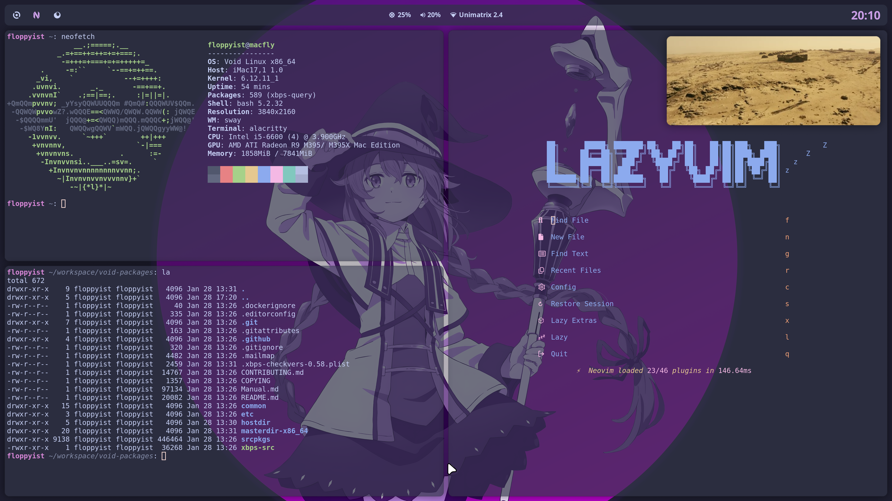

# Dotfiles for Sway(fx), Alacritty, LazyVim, Waybar and Wofi

<p align="center">
    
</p>

## Install

* Sway
* SwayFX 
* Waybar
* Wofi
* Alacritty
* LazyVim

You will also need **Nerd Fonts** and **Noto Fonts** if you want to look sway like this.

### Clone repository

```console
git clone https://github.com/floppyist/dotfiles
```

### Install files

```console

mv dotfiles/.bashrc ~
mv dotfiles/* ~/.config
```

### Cleanup

```console
rm -r ~/.config/.git
rm -r ~/.config/screenshots
rm ~/.config/README.md
```
## Screenshots

<p align="center">
    
</p>

