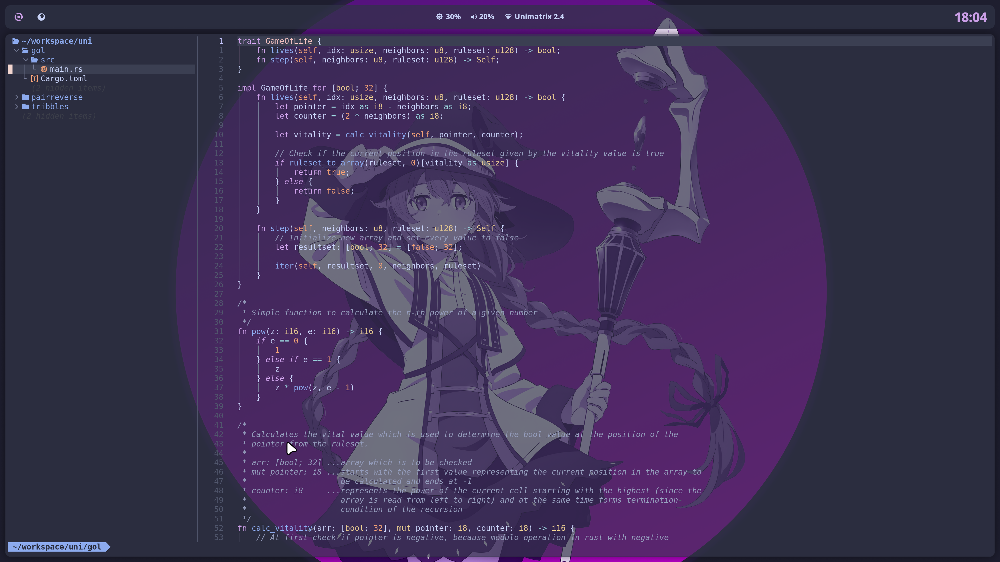

# Dotfiles for Sway(fx), Alacritty, Firefox, LazyVim, Waybar and Wofi

<p align="center">
    
</p>

## Installation

* Sway
* SwayFX 
* Waybar
* Wofi
* Alacritty
* Firefox
* LazyVim
* Nerd Fonts
* Noto Fonts
* Pango Fonts

### Clone repository

```console
git clone https://github.com/floppyist/dotfiles
```

### Install files

```console
mv dotfiles/.bashrc ~
```

```console
mv dotfiles/* ~/.config
```

```console
mv ~/.config/firefox/userChrome.css ~/.mozilla/firefox/<YOUR_PROFILE>/chrome/
```

### Cleanup

```console
rm -r ~/.config/.git
```

```console
rm -r ~/.config/screenshots
```

```console
rmdir ~/.config/firefox
```

```console
rm ~/.config/README.md
```

## Configuration

### Add the mac address of your bluetooth device you want to switch on/off fast (left- & right click)
```console
sudo vim ~/.config/waybar/config
```

```bash
"bluetooth": {
    "format-on": "󰂯",
    "format-off": "󰂲",
    "format-disabled": "󰂲",
    "format-connected-battery": "󰂯 {device_alias} {icon}",
    "format-icons": ["","","","",""],
    "on-click": "bluetoothctl connect YOUR_BLUETOOTH_DEVICE_MAC_ADDRESS",
    "on-click-right": "bluetoothctl disconnect",
},
```
## Screenshots

<p align="center">
    
</p>

<p align="center">
    
</p>
